<p align="center">
  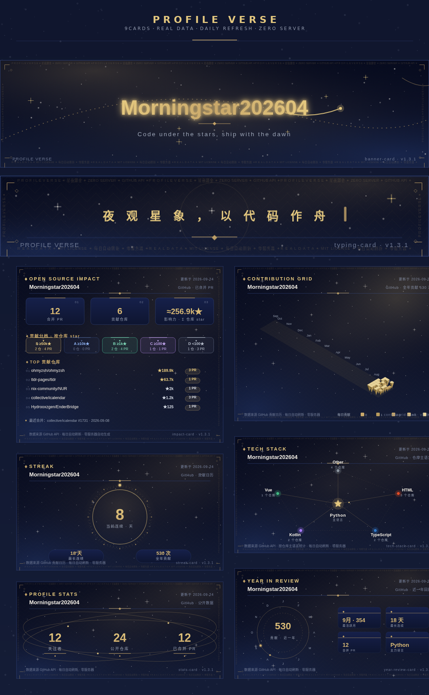
</p>

<h1 align="center">Profile Verse</h1>

<p align="center">
  <b>Every section of your GitHub profile — reimagined as a beautiful, cohesive card.</b><br/>
  Zero server · Zero cost · Real data · Dark &amp; light themes · One repo, all cards.
</p>

<p align="center">
  <a href="https://github.com/Morningstar202604/profile-verse/stargazers"></a>
  <a href="https://github.com/Morningstar202604/profile-verse/forks"></a>
  <a href="https://github.com/Morningstar202604/profile-verse/actions"></a>
  <a href="LICENSE"></a>
  <a href="https://github.com/Morningstar202604/profile-verse/releases"></a>
  <a href="README.zh.md"></a>
</p>

**Profile Verse** replaces every block of your GitHub homepage with one signature card — a typing header, a 3D contribution grid, a golden impact medal row, a constellation tech stack, and more. Everything shares one design language: **starry night × gilded gold**, with a real **dark/light theme** for each card.

No servers, no databases, no billing card. Cards are pure SVG generated by GitHub Actions (free) and refreshed daily — the data is **real**, pulled straight from the GitHub API, and each card stamps its source and update time.

> 🚀 **Live demo**: [Morningstar202604's homepage](https://github.com/Morningstar202604/Morningstar202604) runs 7 Profile Verse cards today.

---

## ✨ Why you'll like it

| | Profile Verse | Common solutions |
|---|---|---|
| **Look** | One cohesive starry-gold design language, each card with a **signature shape** | Stacked plain bars, identical to everyone else |
| **Themes** | Every card ships **dark + light**, follows your system | Dark only, or broken in light mode |
| **Data** | Real GitHub API data, source + timestamp stamped on card | Static snapshots or fake numbers |
| **Cost** | $0 forever — SVG generated by free Actions | Paid APIs, self-hosted servers |
| **Setup** | One workflow file, copy & paste | Many services to configure |
| **Snake?** | No snake. No clone wars. | 🐍 everywhere |

## 🚀 Quick start (whole-homepage kit)

Add this single workflow to your profile repo (`.github/workflows/profile-verse.yml`), and all 7 cards appear on your homepage — auto-refreshed daily. Set `theme:` to `dark` or `light` (or trigger manually to pick).

```yaml
name: Profile Verse Cards

on:
  schedule:
    - cron: "10 1 * * *"
  workflow_dispatch:
    inputs:
      theme:
        description: dark or light
        default: dark

permissions:
  contents: write

concurrency:
  group: profile-verse
  cancel-in-progress: true

jobs:
  cards:
    runs-on: ubuntu-latest
    timeout-minutes: 15
    steps:
      - uses: actions/checkout@v4

      - name: Banner
        uses: Morningstar202604/profile-verse/components/banner-card@v1
        with:
          name: your-github-username
          output: assets/profile-verse/banner-card.svg
          theme: ${{ inputs.theme }}

      - name: Typing
        uses: Morningstar202604/profile-verse/components/typing-card@v1
        with:
          phrases: "Hello, I am a developer;Code under the stars"
          output: assets/profile-verse/typing-card.svg
          theme: ${{ inputs.theme }}

      - name: Stats
        uses: Morningstar202604/profile-verse/components/stats-card@v1
        with:
          user: your-github-username
          output: assets/profile-verse/stats-card.svg
          theme: ${{ inputs.theme }}

      - name: Streak
        uses: Morningstar202604/profile-verse/components/streak-card@v1
        with:
          user: your-github-username
          output: assets/profile-verse/streak-card.svg
          theme: ${{ inputs.theme }}

      - name: Contribution grid (3D)
        uses: Morningstar202604/profile-verse/components/contrib-grid-card@v1
        with:
          user: your-github-username
          output: assets/profile-verse/contrib-grid-card.svg
          theme: ${{ inputs.theme }}

      - name: Tech stack
        uses: Morningstar202604/profile-verse/components/tech-stack-card@v1
        with:
          user: your-github-username
          output: assets/profile-verse/tech-stack-card.svg
          theme: ${{ inputs.theme }}

      - name: Badges
        uses: Morningstar202604/profile-verse/components/badge-card@v1
        with:
          user: your-github-username
          output: assets/profile-verse/badge-card.svg
          theme: ${{ inputs.theme }}

      - name: Impact (merged PRs by repo star tiers)
        uses: Morningstar202604/profile-verse/components/impact-card@v1
        with:
          users: your-github-username        # multi-account: a,b
          output: assets/profile-verse/impact-card.svg
          theme: ${{ inputs.theme }}

      - name: Commit & push
        run: |
          git config user.name "github-actions[bot]"
          git config user.email "github-actions[bot]@users.noreply.github.com"
          git add assets/profile-verse
          if git diff --cached --quiet; then echo "no changes"; else
            git commit -m "chore: refresh profile-verse cards [skip ci]"
            git pull --rebase origin main || git rebase --abort
            git push
          fi
```

Then reference the cards in your `README.md` — use a `<picture>` block so the card **automatically switches with your visitor's system theme**:

```markdown
<picture>
  <source media="(prefers-color-scheme: dark)" srcset="./assets/profile-verse/impact-card.svg">
  
</picture>
```

That's it. No server, no cost, refreshed daily.

## 🗂 Component gallery — 9 cards × 2 themes

Every card has a **dark** (starry night) and **light** (paper) version.

### 1 · impact-card — Open-source impact
Your merged PRs, valued by the star tiers of the repos you contributed to — gilded tiers from S (≥50k★) down to D, plus a TOP-repos leaderboard. The "gold content" of your profile.

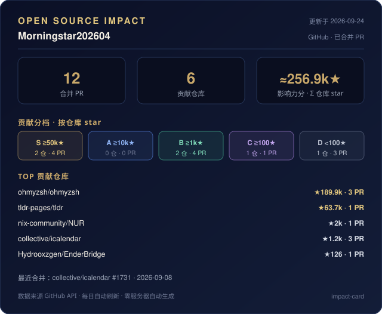
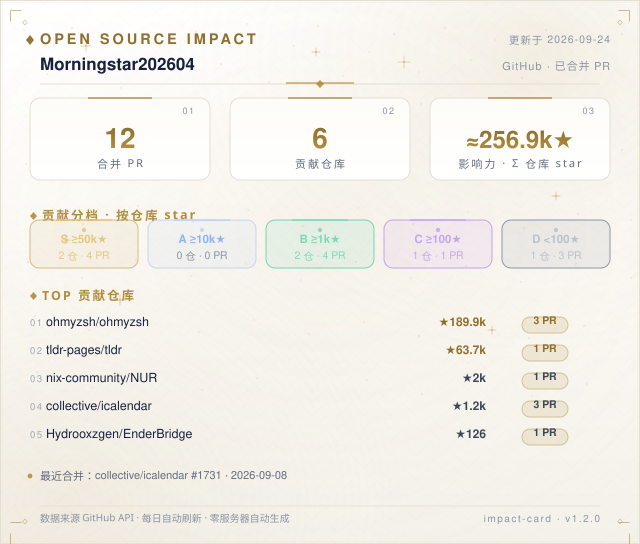

```yaml
- uses: Morningstar202604/profile-verse/components/impact-card@v1
  with:
    users: your-github-username      # multi-account: a,b
    output: impact-card.svg
```

### 2 · stats-card — Minimal stats
Followers / public repos / merged PRs riding a golden orbit. Big numbers, little noise.

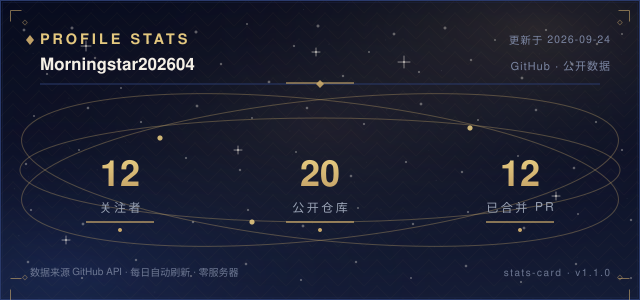
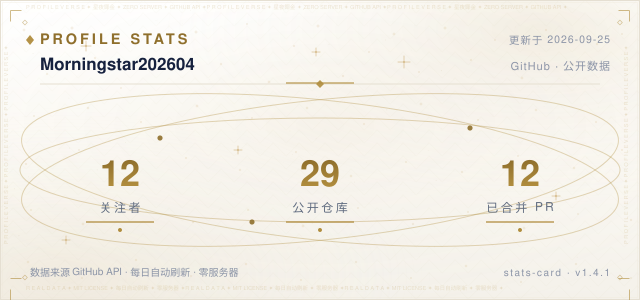

```yaml
- uses: Morningstar202604/profile-verse/components/stats-card@v1
  with:
    user: your-github-username
    output: stats-card.svg
```

### 3 · streak-card — Streak ring
Your current streak is the bright star at the center of a 60-tick dial. Real contribution calendar data.

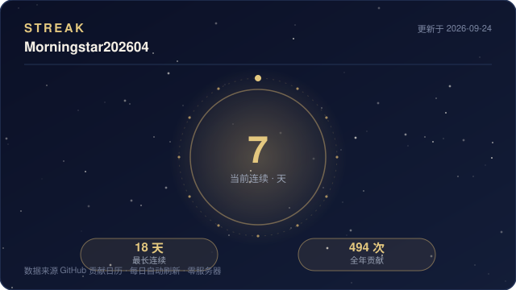
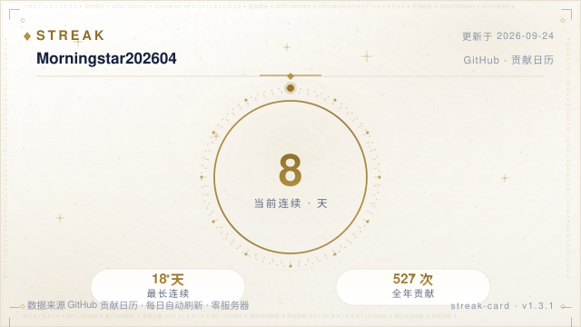

```yaml
- uses: Morningstar202604/profile-verse/components/streak-card@v1
  with:
    user: your-github-username
    output: streak-card.svg
```

### 4 · typing-card — Starry typewriter
Your tagline types itself out under the stars with a blinking gold cursor. Pure SVG + SMIL, no external service.


```yaml
- uses: Morningstar202604/profile-verse/components/typing-card@v1
  with:
    phrases: "First line;Second line;Third phrase"   # up to 3
    output: typing-card.svg
```

### 5 · contrib-grid-card — 3D contribution columns
An isometric golden contribution grid (light top / mid side / dark side), five gold tiers, 53 weeks. The "obviously different" card on your profile.

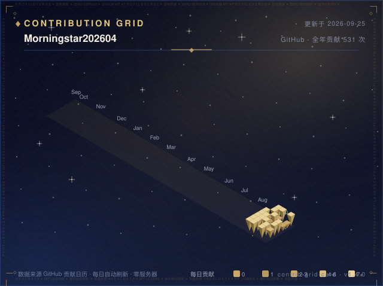
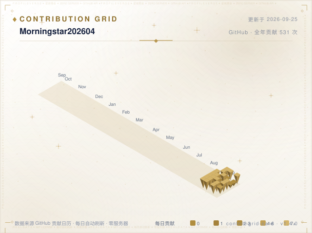

```yaml
- uses: Morningstar202604/profile-verse/components/contrib-grid-card@v1
  with:
    user: your-github-username
    output: contrib-grid-card.svg
```

> 🌱 **Standalone release**: this card also ships alone as
> [**Morningstar202604/contrib-grid-card**](https://github.com/Morningstar202604/contrib-grid-card)
> — `uses: Morningstar202604/contrib-grid-card@v1`, no need for the full family.

### 6 · tech-stack-card — Tech constellation
Your main language is the central star; others orbit on golden ellipses and connect into a constellation. Built from your real repo languages.

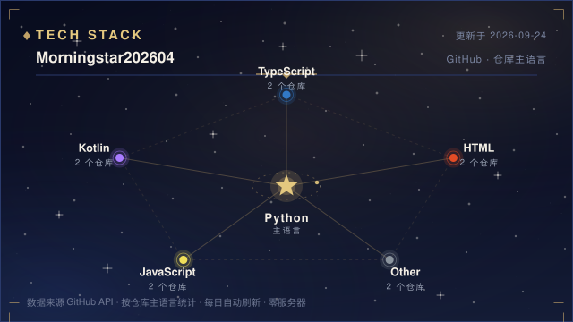
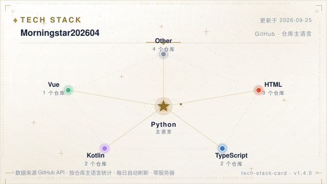

```yaml
- uses: Morningstar202604/profile-verse/components/tech-stack-card@v1
  with:
    user: your-github-username
    output: tech-stack-card.svg
```

### 7 · banner-card — Panorama header
Your glowing name, gradient text, comet trails. Pure visual, no API.


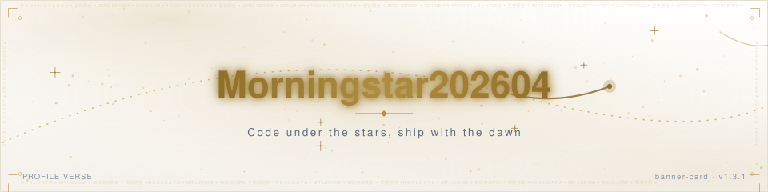

```yaml
- uses: Morningstar202604/profile-verse/components/banner-card@v1
  with:
    name: your-name
    output: banner-card.svg
```

### 8 · badge-card — Golden medals
A row of golden medal badges (gradient edge + star icon) instead of flat shields. Real data by default, fully customizable.

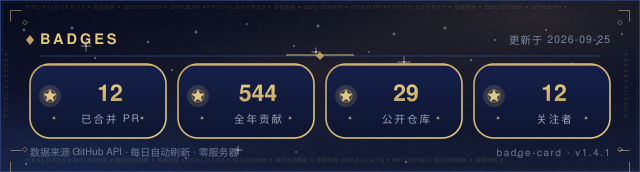
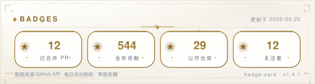

```yaml
- uses: Morningstar202604/profile-verse/components/badge-card@v1
  with:
    user: your-github-username
    output: badge-card.svg
    # badges: "PRs=12;Stars=256.9k;Repos=19"   # optional: fully custom
```

### 9 · year-review-card — Annual ring
Twelve months orbit a golden ring — the bigger and brighter the star, the more you contributed that month. Your year's total glows at the center, with four star-medals: peak month / longest streak / merged PRs / top language. Real 365-day contribution data.

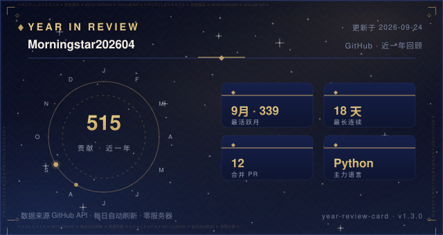
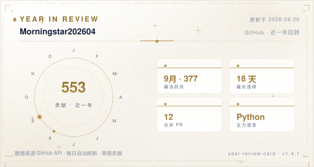

```yaml
- uses: Morningstar202604/profile-verse/components/year-review-card@v1
  with:
    user: your-github-username
    output: year-review-card.svg
```

## 🎨 Design system

- **One glance, one signature**: each card has one distinctive shape — star orbit / dial ring / typewriter / isometric 3D / constellation / comet banner / medals. No clone cards, no snake.
- **Starry night × gilded gold**: deep navy gradient sky + gold only on data (numbers, anchors, medals), muted gray-blue for body text — the numbers shine, not the decoration.
- **Dual theme in one place**: all palettes live in `core/theme.py` — dark (night sky) and light (paper).
- **Real data**: everything goes through `core/github.py` — GitHub API / contribution calendar / star tiers. Cards are refreshed daily and stamp source + timestamp.
- **Room to breathe**: 640px-wide cards, big numbers, few words.

## 🧱 Repository layout

```
profile-verse/
├── core/                     shared core: GitHub API · contribution calendar · star tiers · themes
├── components/
│   ├── impact-card/          component = generator + template + action.yml + README + preview
│   ├── stats-card/
│   ├── streak-card/
│   ├── typing-card/
│   ├── contrib-grid-card/
│   ├── tech-stack-card/
│   ├── year-review-card/
│   ├── banner-card/
│   └── badge-card/
├── examples/                 copy-paste workflows
├── .github/workflows/        daily preview refresh for this repo
└── README.md                 component catalog
```

## 🌱 Standalone releases

Any card can be split out of the monorepo with one command
(`git subtree split --prefix=components/<name>`) and pushed as its own repo —
each repo keeps the full history and gets `@v1`-style references. Done for:
[`contrib-grid-card`](https://github.com/Morningstar202604/contrib-grid-card).

A weekly **Stargazer Wall** issue thanks every new star automatically
(`.github/workflows/star-wall.yml`) — watch [issues](https://github.com/Morningstar202604/profile-verse/issues).

## 🤝 Contributing

New card ideas, theme refinements, bug reports — all welcome. See [CONTRIBUTING](CONTRIBUTING.md), and please follow the [Code of Conduct](CODE_OF_CONDUCT.md).

## 📜 License

MIT © Morningstar202604  ·  [VERSIONING](VERSIONING.md)  ·  [CHANGELOG](CHANGELOG.md)
